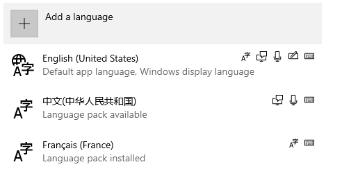

[](https://github.com/ClaudiaCoord/Another-RC-PO-POT-XLIFF-Translate-Toolkit/actions/workflows/msbuild-release.yml) 
[](https://github.com/ClaudiaCoord/Another-RC-PO-POT-XLIFF-Translate-Toolkit/releases/download/1.0.1/AnotherTranslateToolkitx64.msi) 
[](https://github.com/ClaudiaCoord/Another-RC-PO-POT-XLIFF-Translate-Toolkit/releases/download/1.0.1/AnotherTranslateToolkitx86.msi) 

# Management RC/PO/POT/XLIFF languages files - Translate Toolkit

### Project philosophy

The reason why these utilities were written is simple; I could not find working analogues.  
Of course, there is the `Translate Toolkit`  
from © `Translate House`, but from version to version its performance is steadily decreasing...  

<details>
We used original "Translate Toolkit" package before. In addition to the package itself, for full functionality you must also install the latest version of "GetText" from "GNU". From it you need the merge utility, which tidies up the multi-line output from the 'rc2po' and 'po2rc' utilities. This format complies with the standards, but many online resources related to translation into different languages cannot work with it correctly. This is especially evident in the Chinese or Japanese languages: lines are cut off, syntax format errors appear related to unclosed quotes and many other similar faults. 
</details>

  
The main disadvantages that prevent you from using the original Translate Toolkit:  
<details>
  
"po2rc" utility:  
  
1. Does not understand menu tags unless they are inside the 'POPUP' tag.  
2. Dialogue titles, tags 'STYLE', 'FONT', 'CAPTION', 'MENU' are written in one long line, after which the assembly of the RC file causes an error.  
3. Does not understand constructions like '#, fussy', produces the error: "error line:1 symbol:2", regardless of location. At the same time, other utilities from the same package generate just such constructs, for example 'xliff2po'.  
4. If the 'PO' file ends with an empty line, it also produces a similar error that has nothing to do with the problem.  
5. If the source PO file is in a format other than UTF-8, multiple errors are possible, the origin of which is not clear.  
6. If you specify to use UTF-8 encoding for the output file, the file will still be written as UNICODE, in UTF-16 LE format. The way out of this situation is to subsequently convert the output file into UTF-8 format using third-party programs.  

"rc2po" utility:  

1. Does not work correctly with escaped quotes in text, leaves unclosed lines, the file is corrupted.  
2. It does not always process constructs like '{0}/{1}' related to the string format correctly; the file is corrupted.  
3. It does not filter by numeric values, that is, strings consisting only of numbers will also be added to the translation.  
4. Adds empty lines consisting of one space to the translation.  
4. It does not have settings that affect multi-line output of values; it is impossible to change this behavior.  
5. Does not have settings to prevent spam recording of line identifiers, thereby increasing the file size several times. This makes viewing and analyzing the source file very difficult.  
6. When using UTF-8 and missing the 'UTF-8 BOM' header at the beginning of the file, it produces the error: "error line:1 symbol:2".  

"xliff2po" utility:  

1. Adds the construction '#, fussy' to each 'msgid + msgtext' pair; other utilities from the same package do not understand this construction, which leads to a processing error. There is no way to disable this behavior.  
2. Does not replace the '&' sign in the 'xliff' format with the '\&amp;' html tag. Since the 'xliff' format is a subset of the 'XML' format, this results in an error. No further processing of such a file is possible.  
</details>


### Perfomance

Also, we must take into account that these utilities in the original `Translate Toolkit` package are written in `python`. This affects processing speed. With a large volume of files, more than 100, the conversion time becomes noticeable.  

All utilities included in the `Another Translate Toolkit` package are written in C++, so the processing speed of language files is close to maximum. Compiled packages are available for Windows [x64](https://github.com/ClaudiaCoord/Another-RC-PO-POT-XLIFF-Translate-Toolkit/releases/download/1.0.0/AnotherTranslateToolkitx64.msi) and [x86](https://github.com/ClaudiaCoord/Another-RC-PO-POT-XLIFF-Translate-Toolkit/releases/download/1.0.0/AnotherTranslateToolkitx86.msi) platforms.  

### Usage/Command line

#### rc2pot.exe:  
```
Conversion RC to PO/POT files  

Usage: rc2pot.exe [options...]  
Options:  
    -r, --rcinput          RC input file, full path (Required)  
    -o, --output           PO/POT output file, full path, or use -d option  
    -d, --directory        PO/POT output directory, full path, or use -o option  
    -e, --exclude          By default, exclude file it is in the directory of the executable, and name 'rc2pot.exclude'  
    -h, --help             this help page..  

	rc2pot.exe -r x:\path\to\file\resource.rc -o x:\path\to\file\resource.pot  
	rc2pot.exe -r x:\path\to\file\resource.rc -d x:\path\output\directory  

```

#### po2rc.exe:  
```
Conversion PO/POT to RC files  

Usage: po2rc.exe [options...]  
Options:  
    -s, --langtemplate     RC template language, two chars: EN,RU..  
    -l, --langoutput       Output language, two chars: EN,DE,de-DE.. (Required)
    -i, --langid           Output language Microsoft ID: LANG_*, optional, absolute
    -n, --normalize        normalize translated text  
    -p, --poinput          PO input file, full path (Required)  
    -t, --template         RC input template file, full path (Required)  
    -o, --rcoutput         RC output file, full path, or use -d option  
    -d, --directory        RC output directory, required -s and -l options, full path, or use -o option  
    -e, --exclude          By default, exclude file it is in the directory of the executable, and name 'po2rc.exclude'  
    -h, --help             this help page..  

	po2rc.exe -s RU -l ZU -i LANG_ZULU  
		-p x:\path\to\file\resource.po -t x:\path\to\file\template.rc -d x:\path\output\directory  
	po2rc.exe -s RU -l ZU
		-p x:\path\to\file\resource.po -t x:\path\to\file\template.rc -d x:\path\output\directory  
	po2rc.exe -l ZU  
		-p x:\path\to\file\resource.po -t x:\path\to\file\template.rc -o x:\path\output\resource.rc  

```

#### xlf2rc:  
```
Conversion XLIFF to RC files

Usage: xlf2rc.exe [options...]
Options:
    -s, --langtemplate     RC template language, two chars: EN,RU..
    -l, --langoutput       Output language, two chars: EN,DE,de-DE.. (Required)
    -i, --langid           Output language Microsoft ID: LANG_*, optional, absolute
    -n, --normalize        normalize translated text
    -x, --xliffinput       XLIFF input file, full path (Required)
    -t, --template         RC input template file, full path (Required)
    -o, --rcoutput         RC output file, full path, or use -d option
    -d, --directory        RC output directory, required -s and -l options, full path, or use -o option
    -e, --exclude          By default, exclude file it is in the directory of the executable, and name 'xlf2rc.exclude'
    -h, --help             this help page..       

	xlf2rc.exe -s RU -l ZU -i LANG_ZULU
		-x y:\path\to\file\resource.po -t x:\path\to\file\template.rc -d x:\path\output\directory
	xlf2rc.exe -s RU -l ZU
		-x y:\path\to\file\resource.po -t x:\path\to\file\template.rc -d x:\path\output\directory
	xlf2rc.exe -l ZU
		-x y:\path\to\file\resource.xlf -t x:\path\to\file\template.rc -o x:\path\output\resource.rc

```

#### xlf2po.exe:  
```
Conversion XLIFF to PO/POT files  

Usage: xlf2po.exe [options...]  
Options:  
    -x, --xliffinput       XLIFF input file, full path (Required)  
    -p, --pot              output POT file, 'msgstr' empty  
    -r, --reverse          Change primary language to output POT file, required -p option  
    -n, --normalize        normalize translated text
    -o, --output           PO/POT output file, full path, or use -d option  
    -d, --directory        PO/POT output directory, full path, or use -o option  
    -h, --help             this help page..  

	xlf2po.exe -x y:\path\to\file\resource.xlf -o x:\path\to\file\resource.po  
	xlf2po.exe -x y:\path\to\file\resource.xlf -d x:\path\output\directory  

```

#### lang2id.exe:  
```
Conversion NLS string to Microsoft constant Languages ID

Usage: lang2id.exe [options...]  
Options:  
    -h, --help             this help page..  

	lang2id.exe LANG_GERMAN 
	lang2id.exe German  
	lang2id.exe DE  
	lang2id.exe de-DE  

```


#### id2lang.exe:  
```
Conversion NLS string to Microsoft Language and Sub Language ID  

Usage: id2lang.exe [options...]  
Options:  
    -h, --help             this help page..  

	lang2id.exe DE
	lang2id.exe de-DE
	lang2id.exe de_DE  

```

#### po2spell.exe:  
```
Spelling Checker PO/POT files

Usage: po2spell.exe [options...]
Options:
    -s, --list             Print list of supported languages
    -l, --lang             Select a test language from the supported languages, Microsoft ID: en-US, de-DE..
    -c, --count            Suggestions output count: 0-1000
    -a, --auto             Spell check, automatic text update, default option: disabled.
    -p, --poinput          PO/POT input file, full path (Required)
    -o, --pooutput         PO/POT output file, full path, optionals
    -r, --reverse          Change the primary language for the POT input file
    -e, --exclude          By default, exclude file it is in the directory of the executable, and name 'po2spell.<Microsoft language ID>.exclude'
    -h, --help             this help page..       

	po2spell.exe -s
	po2spell.exe -l en-US -c 10 -p x:\path\to\file\resource.po
	po2spell.exe -l en-US -a -p x:\path\to\file\resource.po

```

[Microsoft translator language support](https://www.microsoft.com/en-us/translator/help/windows-10/)  

